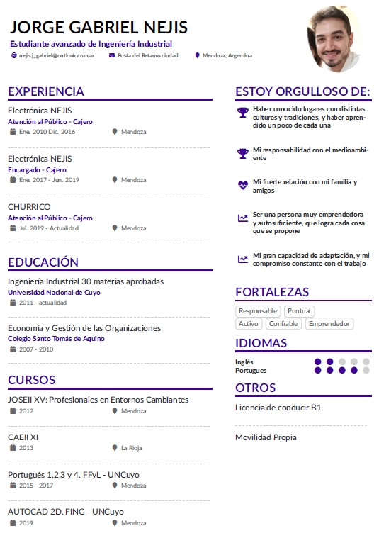
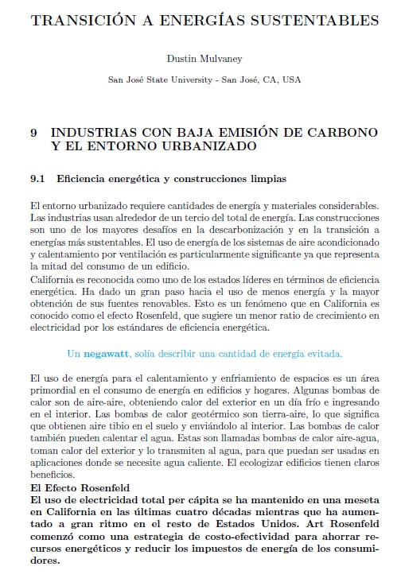

## Técnicas y Herramientas Modernas - Facultad de Ingeniería
## Módulo 1: Producción de Textos e Hipertextos
### Currículum Vitae

El primer trabajo fue la creación del CV en formato LaTex, mediante la plataforma Overleaf.

Para poder acceder, hacer click [aquí](https://github.com/GabrielNejis/GabrielNejis/tree/main/CV) .

A continuación se adjunta una vista rápida del CV.

### Traducción

El segundo trabajo fue la traducción de la Unidad 9 del libro "Sustainable Energy Transition", también en formato LaTex mediante la plataforma Overleaf.

Para poder acceder, hacer click [aquí](https://github.com/GabrielNejis/GabrielNejis/tree/main/Traducci%C3%B3n).

A continuación se adjunta una vista rápida de la primera hoja del texto.

